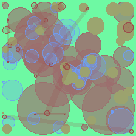
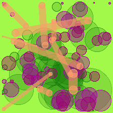

# christmAIs

christmAIs ("krees-ma-ees") is text-to-abstract art generation for the holidays!

This project takes inspiration from Tom White's [perception
engines](https://medium.com/artists-and-machine-intelligence/perception-engines-8a46bc598d57)
and his [drawing system](https://github.com/dribnet/dopes) to generate abstract
art. 

Given a text input, a FastText model converts it into an 8-bit embedding, and
is used as a random seed for the drawing system. The generated images are then
fed to an ImageNet-trained classifier for prediction. The idea is that we keep
on perturbing the images until the classifier recognizes the target class
(tree, shopping cart, etc.).

## Requirements

Please see `requirements.txt` for all dependencies and `requirements-dev.txt` for dev dependencies.

## Set-up

First, clone this repository to your local machine:

```shell
$ git clone https://github.com/thinkingmachines/christmAIs.git
```

It is highly-recommended to use a virtual environment to set this project up
and install the dependencies:

```shell
$ cd christmAIs 
$ virtualenv venv
$ source venv/bin/activate
$ pip install -r requirements.txt # or requirements-dev.txt
```

## Usage

There are three important components for this perception engine to work:
- `christmais.FastTextWrapper`: maps a string into an 8-bit vector
- `christmais.Artist`: maps an 8-bit vector into an image
- `christmais.Predictor`: classifies an image into a particular object

In addition, there is also a `christmais.Trainer` class that takes all three
components, then performs a random walk in order to find the abstract art that
best resembles a target object.

### Map a string into an 8-bit vector

This module contains a wrapper for `gensim.FastText` to create word embeddings
for a given text.

```python
from christmais import FastTextWrapper
from nltk.corpus import brown # or any other corpus

# Train the model
model = FastTextWrapper(sentences=brown.sents())
# Embed a text
my_text = "Thinking Machines Data Science"
model.transform(my_text)
```

Or, you can simply use a pre-trained FastText model on the brown corpus (note:
if no `.model` is found in your `/tmp/` directory, then it trains as usual):

```python
from christmais import get_fasttext_pretrained
# Assuming that /tmp/brown_fasttext.model exists
model = get_fasttext_pretrained(load=True)
# Embed a text
my_text = "Thinking Machines Data Science"
model.transform(my_text)
```

### Map an 8-bit vector into an image

Once you have generated a word embedding, you can then use it as a seed to the
drawing system, a.k.a. the `Artist` class:

```python
from christmais import (get_fasttext_pretrained, Artist)

model = get_fasttext_pretrained(load=True)
seed = model.transform("Thinking Machines Data Science")
artist = Artist(seed, dims=(224, 224)) 
artist.draw()
```





### Map an image into an ImageNet class

The generated image can then be used as an input to a classifier trained on ImageNet.
You can supply an ImageNet class and it will return the probability (or confidence)
that this image looks like this class.

```python
from christmais import Predictor

# Map text to seed
model = get_fasttext_pretrained(load=True)
seed = model.transform("Thinking Machines Data Science")

# Map seed to image
artist = Artist(seed, dims=(224, 224)) 
img = artist.draw()

# Map image to ImageNet class
# We want to check how well the class recognizes the image as an "iron"
predictor = Predictor()
score, results = predictor.predict(X=img, target="iron")
```

We can then print the results. Since there is no optimization happening yet,
don't expect that the score is high at the very start!

```python
>>> print(score)
0.0003216064
```

